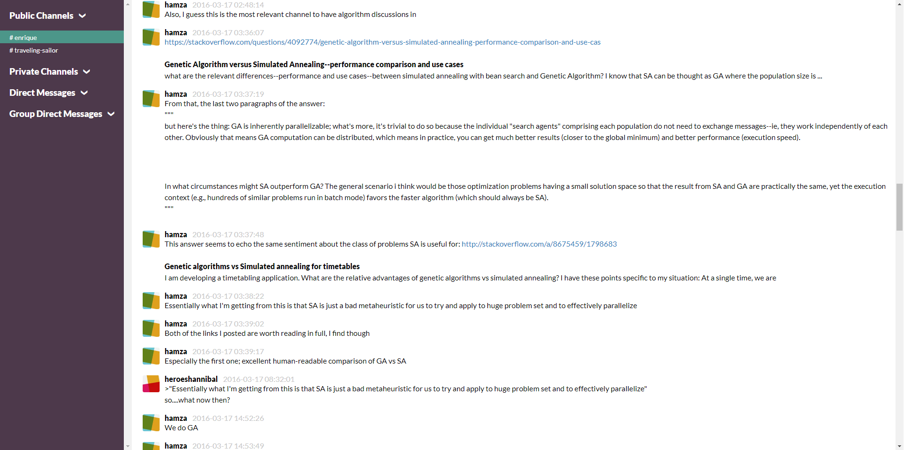

# Slack Export Viewer

[](https://travis-ci.org/hfaran/slack-export-viewer)
[](http://badge.fury.io/py/slack-export-viewer)

A Slack Export archive viewer that allows you to easily view and share your 
Slack team's export (instead of having to dive into hundreds of JSON files).




## Contents

* [Overview](#overview)
* [Installation](#installation)
* [Usage](#usage)
* [Acknowledgements](#acknowledgements)

## Overview

`slack-export-viewer` is useful for small teams on a free Slack plan (limited to 10,000 messages) who overrun their budget and ocassionally need a nice interface to refer back to previous messages. You get a web interface to easily scroll through all channels in the export without having to look at individual JSON files per channel per day.

`slack-export-viewer` can be used locally on one machine for yourself to explore an export or it can be run on a headless server (as it is a Flask web app) if you also want to serve the content to the rest of your team.


## Installation

Manual
```
git clone git@github.com:davida26/slack-export2.git
mv slack-export-viewer
cd slack-export-viewer
python setup.py install

```

Or just feel free to use `pip` as you like.

```zsh
sudo pip install -e "git://git@github.com:davida26/slack-export2.git#egg=slack-export-viewer"
```

```bash
pip install git://git@github.com:davida26/slack-export2.git#egg=slack-export-viewer
```

`slack-export-viewer` will be installed as an entry-point; run from anywhere.

```bash
$ slack-export-viewer --help
Usage: slack-export-viewer [OPTIONS]

Options:
  -p, --port INTEGER  Host port to serve your content on
  -z, --archive PATH  Path to your Slack export archive (.zip file or directory)
                      [required]
  -I, --ip TEXT       Host IP to serve your content on
  --no-browser        If you do not want a browser to open automatically, set
                      this.
  --debug
  --help              Show this message and exit.
```


## Usage

### 1) Grab your Slack team's export

* Visit [https://my.slack.com/services/export](https://my.slack.com/services/export)
* Create an export
* Wait for it to complete
* Refresh the page and download the export (.zip file) into whatever directory

### 2) Point `slack-export-viewer` to it

Point slack-export-viewer to the .zip file and let it do its magic

```bash
slack-export-viewer -z /path/to/export/zip
```

If everything went well, your archive will have been extracted, processed, and browser window will have opened showing your *#general* channel from the export.

## CLI

There is now a CLI included as well. Currently the one command you can use is clearing the cache from slack-export-viewer from your %TEMP% directory; see usage:

```
└———→ slack-export-viewer-cli --help
Usage: slack-export-viewer-cli [OPTIONS] COMMAND [ARGS]...

Options:
  --help  Show this message and exit.

Commands:
  clean  Cleans up any temporary files (including...
```

### Examples

```
┌— hamza@AURORAONE C:\Users\hamza
└———→ slack-export-viewer-cli clean
Run with -w to remove C:\Users\hamza\AppData\Local\Temp\_slackviewer
┌— hamza@AURORAONE C:\Users\hamza
└———→ slack-export-viewer-cli clean -w
Removing C:\Users\hamza\AppData\Local\Temp\_slackviewer...
```

## Acknowledgements

Credit to Pieter Levels whose [blog post](https://levels.io/slack-export-to-html/) and PHP script I used as a jumping off point for this.

Credit to Hamza for improvements over Pieter's script


### Improvements over Hamza's script

 Support for external workspaces
 Handling cases where users or things like GIFS are not found by ID
 Added new script to make it easier to run. Simply click to run and drag the slack .zip file into the window.
 https://www.dropbox.com/s/8zniqao3v8dz417/slack-export-viewer.bat?dl=0
